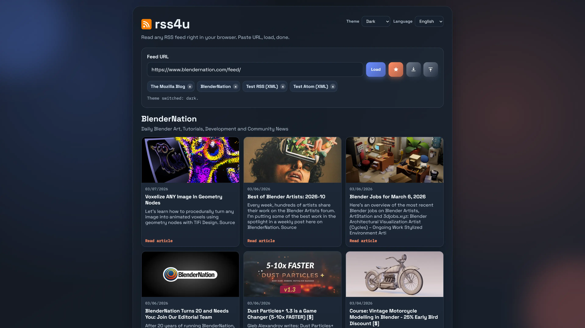
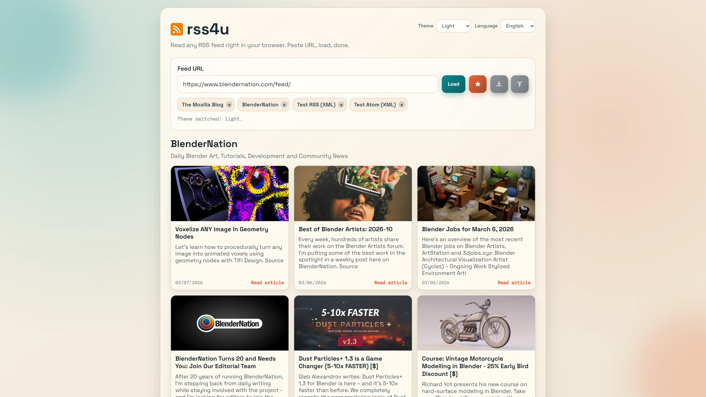

# rss4u

A browser-based RSS reader built with plain HTML, CSS, and JavaScript.

## short description

rss4u is a privacy-friendly RSS reader that runs entirely in the browser.
It only needs a simple static web server and does not require server-side scripts or a database.
Your data and feed files stay in your browser, not on some cloud service.

Copyright (C) 2026 Frank Winter.

## Live Demo

Try rss4u on GitHub Pages:

- https://fwdotcom.github.io/rss4u/

## License

This project is licensed under the MIT License.

See [LICENSE](./LICENSE).

## Features

- Load RSS and Atom feeds from a URL input
- Save/remove favorites and load them from quick-feed chips
- Import/export favorites as JSON
- Theme support
- Language support
- Locale-driven date formatting via translation files
- Per-theme tile templates with placeholders (`{{headline}}`, `{{description}}`, `{{date}}`, `{{image}}`, `{{theme}}`, `{{article_action}}`)
- CORS fallback strategy via proxy attempts
- Faster feed loading via parallel fallback attempts, per-request timeout, and short in-memory XML cache
- Feed sanitization for URL-only descriptions

## Screenshots

### Dark Theme



### Light Theme



## Project Structure

- `public/`: web root for app runtime and Pages deployment
- `public/index.html`: app shell and UI layout
- `public/style.css`: base/global styling and shared CSS variables
- `public/script.js`: UI behavior, theme loading, rendering
- `public/rss.js`: RSS logic (URL normalization, fetch, parse)
- `public/locales/`: translation files (`en`, `de`, `fr`, `es`, `it`, `pl`, `cs`, `nl`)
- `public/themes/`: theme-specific CSS, templates, and theme documentation
- `public/themes/README.md`: detailed theming guide
- `build/background.js`: extension click handler (opens app in tab)
- `tests/`: lightweight Node test suite for locale consistency and source guards

## Run Locally

Use a local web server (recommended) so dynamic template loading and fetch calls behave consistently.

Example with VS Code Live Server:

1. Open the project in VS Code
2. Start `Live Server` on `public/index.html`
3. Open the shown local URL in your browser

## Run Tests

The project includes lightweight regression tests for localization consistency and key source guards.

Run from the project root:

```bash
node --test tests/*.test.mjs
```

## Browser Extension Packaging

Build artifacts are created in `build/dist/`.

For the detailed packaging guide, see `build/README.md`.

Recommended one-command build:

```bat
build\build-browser-extensions.bat
```

Browser-specific commands and packaging details are documented in `build/README.md`.

## GitHub Pages Deployment

The repository includes `.github/workflows/deploy-pages.yml`.
On each push to `main`, the workflow:

1. Uploads `public/` as Pages artifact
2. Deploys to GitHub Pages

In repository settings, set **Pages Source** to **GitHub Actions**.

## Theming

Theme definitions are in `public/themes/<theme-name>/` and are registered in `public/script.js`.

Available themes:

- `dark`
- `light`

For full details, see `public/themes/README.md`.

## Localization

- Default language is English (`en`).
- Available languages: `en`, `de`, `fr`, `es`, `it`, `pl`, `cs`, `nl`.
- Translation resources live in `public/locales/*.json`.
- Date formatting locale is configured per language in `formats.dateLocale`.

