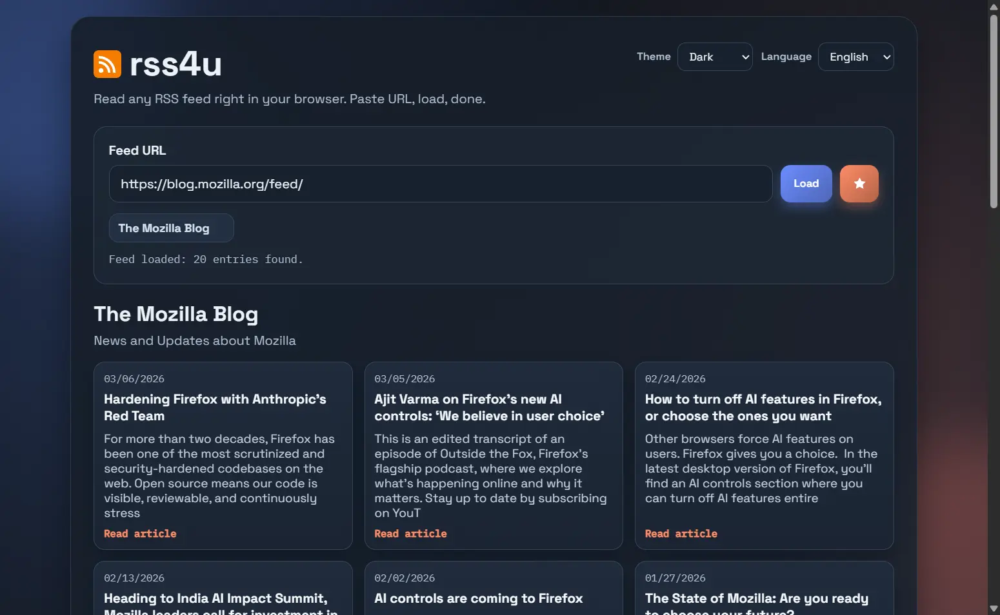

# rss4u

A browser-based RSS reader built with plain HTML, CSS, and JavaScript.

Copyright (C) 2026 Frank Winter.

## License

This project is licensed under the MIT License.

See [LICENSE](./LICENSE).

## Features

- Load RSS and Atom feeds from a URL input
- Quick feed buttons for common sources
- Theme support (`dark` and `light`)
- Language support (`en` default) with JSON locale files
- Per-theme tile templates with placeholders (`{{headline}}`, `{{description}}`, `{{date}}`, `{{link}}`, `{{image}}`, `{{theme}}`, `{{article_label}}`)
- CORS fallback strategy via proxy attempts
- Feed sanitization for URL-only descriptions (for example common Hacker News feed edge cases)

## Screenshots

### Dark Theme

### Light Theme

## Project Structure

- `index.html`: app shell and UI layout
- `style.css`: base/global styling and shared CSS variables
- `script.js`: UI behavior, theme loading, rendering
- `rss.js`: RSS logic (URL normalization, fetch, parse)
- `locales/`: translation files (`en`, `de`, `fr`, `es`, `it`, `pl`, `cs`, `nl`)
- `themes/`: theme-specific CSS, templates, and theme documentation
- `themes/README.md`: detailed theming guide

## Run Locally

Use a local web server (recommended) so dynamic template loading and fetch calls behave consistently.

Example with VS Code Live Server:

1. Open the project in VS Code
2. Start `Live Server` on `index.html`
3. Open the shown local URL in your browser

## Theming

Theme definitions are in `themes/<theme-name>/` and are registered in `script.js`.

Available themes:

- `dark`
- `light`

For full details, see `themes/README.md`.

## Localization

- Default language is English (`en`).
- Available languages: `en`, `de`, `fr`, `es`, `it`, `pl`, `cs`, `nl`.
- Translation resources live in `locales/*.json`.

